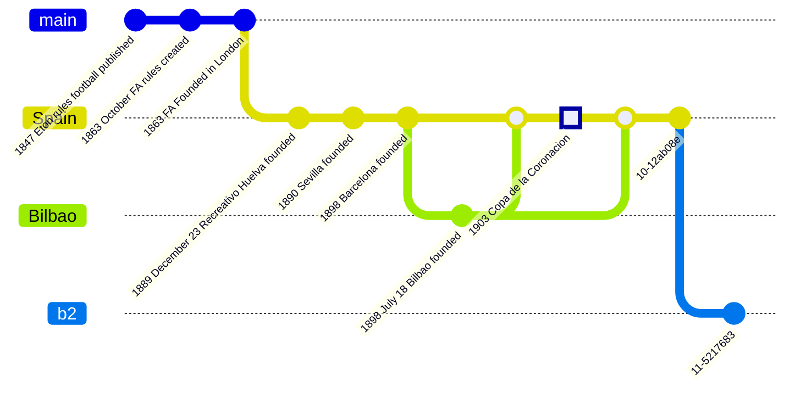

# atleticomadrid
raw digital assets

* TODO 2024-04-24: rotate existing, and add all articles as plaintext files (txt or mwk, not html I think)

```mermaid
gitGraph:
    commit id: "1847 Eton rules football published"
    commit id: "1863 October FA rules created"
    commit id: "1863 FA Founded in London"
    branch Spain
    commit id: "1889 December 23 Recreativo Huelva founded"
    commit id: "1890 Sevilla founded"
    commit id: "1898 Barcelona founded"
    branch Bilbao
    commit id: "1898 July 18 Bilbao founded"
    checkout Bilbao
    checkout Spain
    merge Bilbao
    commit id: "1903 Copa de la Coronacion" type: HIGHLIGHT
    merge Bilbao
    commit
    branch b2
    commit
```
